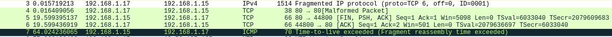
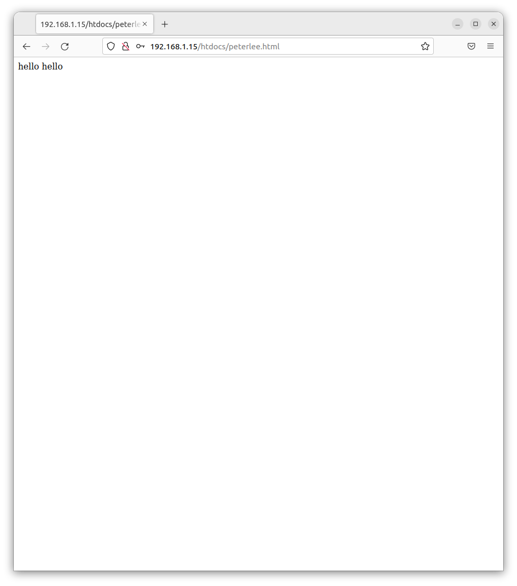

## network/vulnerability scans

### REF 615

#### nmap scan

- nmap port scan

``` console
Starting Nmap 7.92 ( https://nmap.org ) at 2022-06-17 14:10 CDT
Nmap scan report for 192.168.1.15
Host is up (0.00050s latency).
Not shown: 997 closed tcp ports (reset)
PORT      STATE SERVICE
21/tcp    open  ftp
80/tcp    open  http
20000/tcp open  dnp
MAC Address: 00:90:4F:E5:28:CF (ABB Power T&D Company)

Nmap done: 1 IP address (1 host up) scanned in 6.36 seconds
```

- nmap OS scan

``` console
Starting Nmap 7.92 ( https://nmap.org ) at 2022-06-17 14:16 CDT
WARNING: RST from 192.168.1.15 port 21 -- is this port really open?
WARNING: RST from 192.168.1.15 port 21 -- is this port really open?
Nmap scan report for 192.168.1.15
Host is up (0.00046s latency).
Not shown: 997 closed tcp ports (reset)
PORT      STATE SERVICE
21/tcp    open  ftp
80/tcp    open  http
20000/tcp open  dnp
MAC Address: 00:90:4F:E5:28:CF (ABB Power T&D Company)
No exact OS matches for host (If you know what OS is running on it, see https://nmap.org/submit/ ).
TCP/IP fingerprint:
OS:SCAN(V=7.92%E=4%D=6/17%OT=21%CT=1%CU=36613%PV=Y%DS=1%DC=D%G=Y%M=00904F%T
OS:M=62ACD31F%P=x86_64-redhat-linux-gnu)SEQ(SP=A8%GCD=1%ISR=AE%TI=I%CI=I%II
OS:=I%TS=A)OPS(O1=M5AENW0NNSNNT11%O2=M578NW0NNSNNT11%O3=M280NW0NNT11%O4=M5A
OS:ENW0NNSNNT11%O5=M218NW0NNSNNT11%O6=M109NNSNNT11)WIN(W1=1688%W2=15B0%W3=1
OS:12C%W4=1688%W5=126C%W6=11CA)ECN(R=Y%DF=N%T=40%W=16B8%O=M5AENW0NNS%CC=N%Q
OS:=)T1(R=Y%DF=N%T=40%S=O%A=S+%F=AS%RD=0%Q=)T2(R=N)T3(R=N)T4(R=Y%DF=N%T=40%
OS:W=0%S=A%A=Z%F=R%O=%RD=0%Q=)T5(R=Y%DF=N%T=40%W=0%S=Z%A=S+%F=AR%O=%RD=0%Q=
OS:)T6(R=Y%DF=N%T=40%W=0%S=A%A=Z%F=R%O=%RD=0%Q=)T7(R=Y%DF=N%T=40%W=0%S=Z%A=
OS:S+%F=AR%O=%RD=0%Q=)U1(R=Y%DF=N%T=FF%IPL=38%UN=0%RIPL=G%RID=G%RIPCK=G%RUC
OS:K=G%RUD=G)IE(R=Y%DFI=N%T=FF%CD=S)

Network Distance: 1 hop

OS detection performed. Please report any incorrect results at https://nmap.org/submit/ .
Nmap done: 1 IP address (1 host up) scanned in 17.91 seconds
```

- nmap vulnerabiltiy scan

``` console
foo@bar:~$ nmap -sV --script vuln 192.168.1.15
Starting Nmap 7.80 ( https://nmap.org ) at 2022-06-17 15:01 CDT
Nmap scan report for 192.168.1.15
Host is up (0.0011s latency).
Not shown: 997 closed ports
PORT      STATE SERVICE    VERSION
21/tcp    open  ftp        NET Disk/NetStore ftpd (Disabled)
|_clamav-exec: ERROR: Script execution failed (use -d to debug)
|_sslv2-drown: 
80/tcp    open  tcpwrapped
|_clamav-exec: ERROR: Script execution failed (use -d to debug)
|_http-csrf: Couldn't find any CSRF vulnerabilities.
|_http-dombased-xss: Couldn't find any DOM based XSS.
|_http-stored-xss: Couldn't find any stored XSS vulnerabilities.
|_http-vuln-cve2014-3704: ERROR: Script execution failed (use -d to debug)
20000/tcp open  dnp?
|_clamav-exec: ERROR: Script execution failed (use -d to debug)
```

#### nikto scan

``` console
- Nikto v2.1.5
---------------------------------------------------------------------------
+ Target IP:          192.168.1.15
+ Target Hostname:    192.168.1.15
+ Target Port:        80
+ Start Time:         2022-06-17 14:01:02 (GMT-5)
---------------------------------------------------------------------------
+ Server: No banner retrieved
+ The anti-clickjacking X-Frame-Options header is not present.
+ No CGI Directories found (use '-C all' to force check all possible dirs)
+ Allowed HTTP Methods: GET, HEAD, POST, PUT 
+ OSVDB-397: HTTP method ('Allow' Header): 'PUT' method could allow clients to save files on the web server.
+ /catinfo?<u><b>TESTING: The Interscan Viruswall catinfo script is vulnerable to Cross Site Scripting (XSS). http://www.cert.org/advisories/CA-2000-02.html.
+ /search.asp?term=<%00script>alert('Vulnerable')</script>: ASP.Net 1.1 may allow Cross Site Scripting (XSS) in error pages (only some browsers will render this). http://www.cert.org/advisories/CA-2000-02.html.
+ OSVDB-27071: /phpimageview.php?pic=javascript:alert(8754): PHP Image View 1.0 is vulnerable to Cross Site Scripting (XSS).  http://www.cert.org/advisories/CA-2000-02.html.
+ OSVDB-3931: /myphpnuke/links.php?op=search&query=[script]alert('Vulnerable);[/script]?query=: myphpnuke is vulnerable to Cross Site Scripting (XSS). http://www.cert.org/advisories/CA-2000-02.html.
+ OSVDB-3931: /myphpnuke/links.php?op=MostPopular&ratenum=[script]alert(document.cookie);[/script]&ratetype=percent: myphpnuke is vulnerable to Cross Site Scripting (XSS). http://www.cert.org/advisories/CA-2000-02.html.
+ /modules.php?op=modload&name=FAQ&file=index&myfaq=yes&id_cat=1&categories=%3Cimg%20src=javascript:alert(9456);%3E&parent_id=0: Post Nuke 0.7.2.3-Phoenix is vulnerable to Cross Site Scripting (XSS). http://www.cert.org/advisories/CA-2000-02.html.
+ /modules.php?letter=%22%3E%3Cimg%20src=javascript:alert(document.cookie);%3E&op=modload&name=Members_List&file=index: Post Nuke 0.7.2.3-Phoenix is vulnerable to Cross Site Scripting (XSS). http://www.cert.org/advisories/CA-2000-02.html.
+ OSVDB-4598: /members.asp?SF=%22;}alert(223344);function%20x(){v%20=%22: Web Wiz Forums ver. 7.01 and below is vulnerable to Cross Site Scripting (XSS). http://www.cert.org/advisories/CA-2000-02.html.
+ OSVDB-2946: /forum_members.asp?find=%22;}alert(9823);function%20x(){v%20=%22: Web Wiz Forums ver. 7.01 and below is vulnerable to Cross Site Scripting (XSS). http://www.cert.org/advisories/CA-2000-02.html.
+ 6544 items checked: 5155 error(s) and 12 item(s) reported on remote host
+ End Time:           2022-06-17 14:01:46 (GMT-5) (44 seconds)
---------------------------------------------------------------------------
+ 1 host(s) tested

```

#### nmap + metasploit scan

```console
msf6 auxiliary(scanner/portscan/tcp) > run

[+] 192.168.1.15:         - 192.168.1.15:80 - TCP OPEN
[*] 192.168.1.15:         - Scanned 1 of 1 hosts (100% complete)
[*] Auxiliary module execution completed
msf6 auxiliary(scanner/portscan/tcp) > db_nmap -sV -p 80 192.168.1.15
[-] The nmap executable could not be found
msf6 auxiliary(scanner/portscan/tcp) > db_nmap -sV -p 80 192.168.1.15
[*] Nmap: Starting Nmap 7.92 ( https://nmap.org ) at 2022-06-17 13:53 CDT
[*] Nmap: Nmap scan report for 192.168.1.15
[*] Nmap: Host is up (0.0014s latency).
[*] Nmap: PORT   STATE SERVICE    VERSION
[*] Nmap: 80/tcp open  tcpwrapped
[*] Nmap: Service detection performed. Please report any incorrect results at https://nmap.org/submit/ .
[*] Nmap: Nmap done: 1 IP address (1 host up) scanned in 6.11 seconds
msf6 auxiliary(scanner/portscan/tcp) > db_nmap -sV -A -p 80 192.168.1.15
[*] Nmap: Starting Nmap 7.92 ( https://nmap.org ) at 2022-06-17 13:54 CDT
[*] Nmap: Nmap scan report for 192.168.1.15
[*] Nmap: Host is up (0.0010s latency).
[*] Nmap: PORT   STATE SERVICE    VERSION
[*] Nmap: 80/tcp open  tcpwrapped
[*] Nmap: |_http-title: Login
[*] Nmap: | http-methods:
[*] Nmap: |_  Potentially risky methods: PUT
[*] Nmap: Service detection performed. Please report any incorrect results at https://nmap.org/submit/ .
[*] Nmap: Nmap done: 1 IP address (1 host up) scanned in 10.54 seconds
```

# notes

## Jun 18 2022

### TCP fragmentation experiment

- I think sending packet is successful, as we get ACK/FIN from HTTP server. However, nothing happens on the relay side.
- wireshark reads as such:

- further experiments that I should do:
  - send fragmented packets, but hold on to/completely delete the intermediate packet) since all the attacks that I implemented are malformed offset attack, which doesn't seem to have any affect on the relay

### UDP fragmentation experiment

- I am not sure if the packet went through. It's UDP so I am not sure if it received the packet. (1 way communication)
- however, my PC sends BAD UDP LENGTH packet to the HTTP server. Should I filter this from IPTABLES?


### ARP spoofing

- ARP spoofing was a success. As you can see in the image below, the MAC address of gateway address changes before and after the attack. In fact, the mac address of the gateway in the midst of the attack is indeed the mac address of the attacker.

### REF 615 HTTP server

- uses HTTP Digest access authentication
- ftp server and HTTP shares password
- can use PUT command to override ANY file in the relay's server without certification.
  possible attacks
  - flood storage with arbitrary files
  - forge http file and ovewrite server core files
  - find configuration file, take over directly
  - save malicious html file with javascript code and run it to see file structure
- Example curl command
  > curl http://192.168.1.15/ --upload-file peterlee.html
- relative path can also be taken
  > curl http://192.168.1.15/../ --upload-file peterlee.html



### SEL 751 notes
``` command
wonjongbot@computadora:~/Zerg-Rush$ sudo nmap 192.168.1.16
[sudo] password for wonjongbot: 
Starting Nmap 7.80 ( https://nmap.org ) at 2022-06-21 10:35 CDT
Nmap scan report for 192.168.1.16
Host is up (0.092s latency).
Not shown: 998 closed ports
PORT   STATE SERVICE
21/tcp open  ftp
23/tcp open  telnet
MAC Address: 00:30:A7:1F:7A:2C (Schweitzer Engineering)
```
OS scan
``` command
wonjongbot@computadora:~/Zerg-Rush$ sudo nmap 192.168.1.16 -O
Starting Nmap 7.80 ( https://nmap.org ) at 2022-06-21 10:44 CDT
Nmap scan report for 192.168.1.16
Host is up (0.0032s latency).
Not shown: 998 closed ports
PORT   STATE SERVICE
21/tcp open  ftp
23/tcp open  telnet
MAC Address: 00:30:A7:1F:7A:2C (Schweitzer Engineering)
Device type: printer
Running: HP embedded
OS CPE: cpe:/h:hp:laserjet_cp4525 cpe:/h:hp:laserjet_m451dn
OS details: HP LaserJet M451dn, CM1415fnw, or CP4525
Network Distance: 1 hop

```

### ElectroBlox notes

``` command
wonjongbot@computadora:~$ sudo nmap 192.168.1.11
[sudo] password for wonjongbot: 
Starting Nmap 7.80 ( https://nmap.org ) at 2022-06-22 12:56 CDT
Nmap scan report for 192.168.1.11
Host is up (0.00072s latency).
Not shown: 997 filtered ports
PORT   STATE SERVICE
21/tcp open  ftp
23/tcp open  telnet
80/tcp open  http
MAC Address: 00:09:91:45:BE:4C (Intelligent Platforms)
```

``` command
wonjongbot@computadora:~$ sudo nmap 192.168.1.11 -O
Starting Nmap 7.80 ( https://nmap.org ) at 2022-06-22 12:57 CDT
Nmap scan report for 192.168.1.11
Host is up (0.00070s latency).
Not shown: 997 filtered ports
PORT   STATE SERVICE
21/tcp open  ftp
23/tcp open  telnet
80/tcp open  http
MAC Address: 00:09:91:45:BE:4C (Intelligent Platforms)
Warning: OSScan results may be unreliable because we could not find at least 1 open and 1 closed port
Aggressive OS guesses: Roku SoundBridge M500 or M1000 music player (96%), Polycom VSX 7000a video conferencing system (94%), Polycom VSX 7000e/8000 video conferencing system (94%), Stratus ftServer Virtual Technician Module (94%), Head Digital Medialink Black Panther cable receiver (94%), KW-Software ProConOS (94%), Polycom VSX 8000 video conferencing system (94%), D-Link DWL-900AP+, Planet WAP-1966, or USRobotics USR5450 WAP (93%), Denon AVR-3808CI audio/video receiver, Philips SLA5500 or SLA5520 Wireless Music Adapter or WAK3300 wireless alarm clock, or Terratec NOXON audio system (93%), Audio receiver: Bose Soundtouch 20, Bowers & Wilkins Zeppelin Air, Denon AVR-1900-series, Marantz NR1602, or Pioneer VSX-921 (93%)
No exact OS matches for host (test conditions non-ideal).
Network Distance: 1 hop

OS detection performed. Please report any incorrect results at https://nmap.org/submit/ .
Nmap done: 1 IP address (1 host up) scanned in 8.31 seconds

```
``` command
^Cwonjongbot@computadora:~/Zerg-Rush$ nikto -h 192.168.1.11
- Nikto v2.1.5
---------------------------------------------------------------------------
+ Target IP:          192.168.1.11
+ Target Hostname:    192.168.1.11
+ Target Port:        80
+ Start Time:         2022-06-22 13:00:21 (GMT-5)
---------------------------------------------------------------------------
+ Server: InterNiche Technologies WebServer 2.0
+ The anti-clickjacking X-Frame-Options header is not present.
+ Cookie SessionID created without the httponly flag
+ Uncommon header 'refresh' found, with contents: 0;URL=/login.html
+ No CGI Directories found (use '-C all' to force check all possible dirs)

+ /login.html: Admin login page/section found.
+ 6544 items checked: 65 error(s) and 4 item(s) reported on remote host
+ End Time:           2022-06-22 13:03:05 (GMT-5) (164 seconds)
---------------------------------------------------------------------------
+ 1 host(s) tested
```

``` command
msf6 auxiliary(scanner/portscan/tcp) > db_nmap -sV -A -p 80 192.168.1.11
[*] Nmap: Starting Nmap 7.80 ( https://nmap.org ) at 2022-06-22 13:10 CDT
[*] Nmap: Nmap scan report for 192.168.1.11
[*] Nmap: Host is up (0.0010s latency).
[*] Nmap: PORT   STATE SERVICE VERSION
[*] Nmap: 80/tcp open  http    InterNiche Technologies WebServer 2.0
[*] Nmap: | http-cookie-flags:
[*] Nmap: |   /:
[*] Nmap: |     SessionID:
[*] Nmap: |_      httponly flag not set
[*] Nmap: |_http-server-header: InterNiche Technologies WebServer 2.0
[*] Nmap: |_http-title: ElectroBlox
[*] Nmap: Service detection performed. Please report any incorrect results at https://nmap.org/submit/ .
[*] Nmap: Nmap done: 1 IP address (1 host up) scanned in 16.91 seconds
```

```command
msf6 auxiliary(scanner/portscan/tcp) > db_nmap -sV -A -p 21 192.168.1.11
[*] Nmap: Starting Nmap 7.80 ( https://nmap.org ) at 2022-06-22 13:12 CDT
[*] Nmap: Nmap scan report for 192.168.1.11
[*] Nmap: Host is up (0.0023s latency).
[*] Nmap: PORT   STATE SERVICE VERSION
[*] Nmap: 21/tcp open  ftp     Multitech MultiVoip 410 VoIP gateway ftpd
[*] Nmap: | ftp-anon: Anonymous FTP login allowed (FTP code 230)
[*] Nmap: | -rw-rw-rw- 40000000 getsgs getsgs   298 ??? 00 00:00:00 logInfoManager.dat [NSE: writeable]
[*] Nmap: | -rw-rw-rw- 40000000 getsgs getsgs     8 ??? 00 00:00:00 ErrorLogConfig2.dat [NSE: writeable]
[*] Nmap: | -rw-rw-rw- 40000000 getsgs getsgs     8 ??? 00 00:00:00 UserLogConfig.dat [NSE: writeable]
[*] Nmap: | -rw-rw-rw- 40000000 getsgs getsgs    10 ??? 00 00:00:00 DatLogCfg.dat [NSE: writeable]
[*] Nmap: | -rw-rw-rw- 40000000 getsgs getsgs    10 ??? 00 00:00:00 PTCEventLogConfig.dat [NSE: writeable]
[*] Nmap: | -rw-rw-rw- 40000000 getsgs getsgs    10 ??? 00 00:00:00 PTCCommLogConfig.dat [NSE: writeable]
[*] Nmap: | -rw-rw-rw- 40000000 getsgs getsgs    10 ??? 00 00:00:00 PTCDeviceLogConfig.dat [NSE: writeable]
[*] Nmap: | -rw-rw-rw- 40000000 getsgs getsgs    10 ??? 00 00:00:00 SNMPCommLogConfig.dat [NSE: writeable]
[*] Nmap: | drw-rw-rw- 20000000 getsgs getsgs     0 Jan 27 22:28:10 upload [NSE: writeable]
[*] Nmap: |_-rw-rw-rw- 40000000 getsgs getsgs    14 Jan 27 22:28:10 PTCDeviceLogFile.dat [NSE: writeable]
[*] Nmap: |_ftp-bounce: bounce working!
[*] Nmap: Service Info: Device: VoIP adapter
[*] Nmap: Service detection performed. Please report any incorrect results at https://nmap.org/submit/ .
[*] Nmap: Nmap done: 1 IP address (1 host up) scanned in 6.58 seconds
```

```command
msf6 auxiliary(scanner/portscan/tcp) > db_nmap -sV -A -p 23 192.168.1.11
[*] Nmap: Starting Nmap 7.80 ( https://nmap.org ) at 2022-06-22 13:13 CDT
[*] Nmap: Nmap scan report for 192.168.1.11
[*] Nmap: Host is up (0.00095s latency).
[*] Nmap: PORT   STATE SERVICE VERSION
[*] Nmap: 23/tcp open  telnet  APC PDU/UPS devices or Windows CE telnetd
[*] Nmap: | fingerprint-strings:
[*] Nmap: |   GenericLines:
[*] Nmap: |     Welcome to InterNiche Telnet Server 1.0 (Modified by GE)
[*] Nmap: |     login:
[*] Nmap: |     login:
[*] Nmap: |     login:
[*] Nmap: |   GetRequest:
[*] Nmap: |     Welcome to InterNiche Telnet Server 1.0 (Modified by GE)
[*] Nmap: |     login:password:
[*] Nmap: |     login:
[*] Nmap: |   Help:
[*] Nmap: |     Welcome to InterNiche Telnet Server 1.0 (Modified by GE)
[*] Nmap: |     login:password:
[*] Nmap: |   NCP, NULL, RPCCheck, tn3270:
[*] Nmap: |     Welcome to InterNiche Telnet Server 1.0 (Modified by GE)
[*] Nmap: |     login:
[*] Nmap: |   SIPOptions:
[*] Nmap: |     Welcome to InterNiche Telnet Server 1.0 (Modified by GE)
[*] Nmap: |     login:password:
[*] Nmap: |     login:
[*] Nmap: |     password:
[*] Nmap: |     login:
[*] Nmap: |     password:
[*] Nmap: |     login:
[*] Nmap: |     password:
[*] Nmap: |     login:
[*] Nmap: |_    password:
[*] Nmap: 1 service unrecognized despite returning data. If you know the service/version, please submit the following fingerprint at https://nmap.org/cgi-bin/submit.cgi?new-service :
[*] Nmap: SF-Port23-TCP:V=7.80%I=7%D=6/22%Time=62B35BB5%P=x86_64-pc-linux-gnu%r(NULL
[*] Nmap: SF:,56,"\xff\xfb\x01\xff\xfd\x01\xff\xfb\x03\xff\xfd\x03\xff\xfb\x05\xff\x
[*] Nmap: SF:fd\x05Welcome\x20to\x20InterNiche\x20Telnet\x20Server\x201\.0\x20\(Modi
[*] Nmap: SF:fied\x20by\x20GE\)\r\n\r\n\r\nlogin:")%r(GenericLines,6A,"\xff\xfb\x01\
[*] Nmap: SF:xff\xfd\x01\xff\xfb\x03\xff\xfd\x03\xff\xfb\x05\xff\xfd\x05Welcome\x20t
[*] Nmap: SF:o\x20InterNiche\x20Telnet\x20Server\x201\.0\x20\(Modified\x20by\x20GE\)
[*] Nmap: SF:\r\n\r\n\r\nlogin:\r\nlogin:\xff\xf9\r\nlogin:\xff\xf9")%r(tn3270,62,"\
[*] Nmap: SF:xff\xfb\x01\xff\xfd\x01\xff\xfb\x03\xff\xfd\x03\xff\xfb\x05\xff\xfd\x05
[*] Nmap: SF:Welcome\x20to\x20InterNiche\x20Telnet\x20Server\x201\.0\x20\(Modified\x
[*] Nmap: SF:20by\x20GE\)\r\n\r\n\r\nlogin:\xff\xfe\x18\xff\xfe\x19\xff\xfc\x19\xff\
[*] Nmap: SF:xfd\0")%r(GetRequest,6B,"\xff\xfb\x01\xff\xfd\x01\xff\xfb\x03\xff\xfd\x
[*] Nmap: SF:03\xff\xfb\x05\xff\xfd\x05Welcome\x20to\x20InterNiche\x20Telnet\x20Serv
[*] Nmap: SF:er\x201\.0\x20\(Modified\x20by\x20GE\)\r\n\r\n\r\nlogin:password:\xff\x
[*] Nmap: SF:f9\r\nlogin:\xff\xf9")%r(RPCCheck,56,"\xff\xfb\x01\xff\xfd\x01\xff\xfb\
[*] Nmap: SF:x03\xff\xfd\x03\xff\xfb\x05\xff\xfd\x05Welcome\x20to\x20InterNiche\x20T
[*] Nmap: SF:elnet\x20Server\x201\.0\x20\(Modified\x20by\x20GE\)\r\n\r\n\r\nlogin:")
[*] Nmap: SF:%r(Help,61,"\xff\xfb\x01\xff\xfd\x01\xff\xfb\x03\xff\xfd\x03\xff\xfb\x0
[*] Nmap: SF:5\xff\xfd\x05Welcome\x20to\x20InterNiche\x20Telnet\x20Server\x201\.0\x2
[*] Nmap: SF:0\(Modified\x20by\x20GE\)\r\n\r\n\r\nlogin:password:\xff\xf9")%r(SIPOpt
[*] Nmap: SF:ions,B5,"\xff\xfb\x01\xff\xfd\x01\xff\xfb\x03\xff\xfd\x03\xff\xfb\x05\x
[*] Nmap: SF:ff\xfd\x05Welcome\x20to\x20InterNiche\x20Telnet\x20Server\x201\.0\x20\(
[*] Nmap: SF:Modified\x20by\x20GE\)\r\n\r\n\r\nlogin:password:\xff\xf9\r\nlogin:\xff
[*] Nmap: SF:\xf9password:\xff\xf9\r\nlogin:\xff\xf9password:\xff\xf9\r\nlogin:\xff\
[*] Nmap: SF:xf9password:\xff\xf9\r\nlogin:\xff\xf9password:\xff\xf9")%r(NCP,56,"\xf
[*] Nmap: SF:f\xfb\x01\xff\xfd\x01\xff\xfb\x03\xff\xfd\x03\xff\xfb\x05\xff\xfd\x05We
[*] Nmap: SF:lcome\x20to\x20InterNiche\x20Telnet\x20Server\x201\.0\x20\(Modified\x20
[*] Nmap: SF:by\x20GE\)\r\n\r\n\r\nlogin:");
[*] Nmap: Service detection performed. Please report any incorrect results at https://nmap.org/submit/ .
[*] Nmap: Nmap done: 1 IP address (1 host up) scanned in 39.14 seconds
```